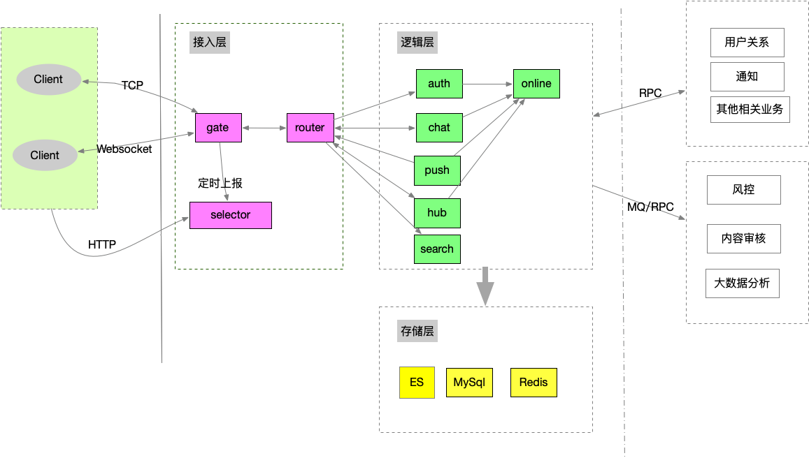

# bubble v1.0
==============

bubble is a im server writen by golang.

## Features
 * 支持Auth
 * 支持tcp，websocket接入
 * 离线消息同步
 * 多业务接入
 * 多设备同时在线
 * 单聊、群聊、超大群
 * 支持水平扩展

## Architecture

### Dependencies
 * MySql
 * Redis
 * ES
 * etcd