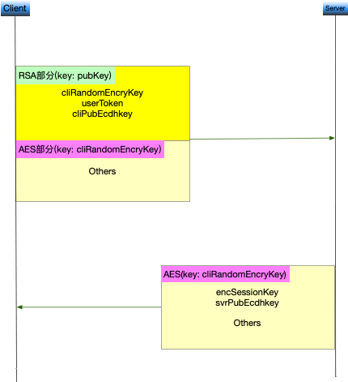
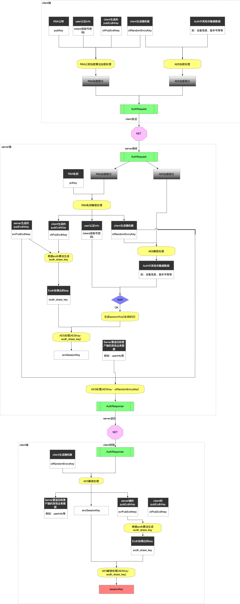
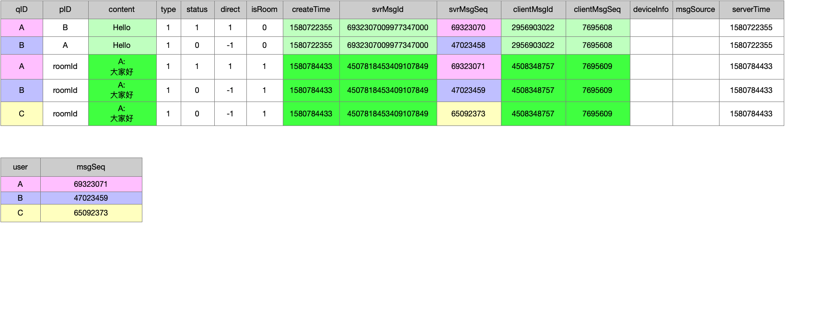

# bubble v1.0

bubble is a im server writen by golang.

## Features
 * 支持Auth
 * 支持tcp，websocket接入
 * 离线消息同步
 * 多业务接入
 * 多设备同时在线
 * 单聊、群聊、超大群
 * 支持水平扩展

## Architecture

以上架构图中，分为几个部分：
* 接入层：主要负责维护与客户端连接相关。
    - gate:网关,暴露给客户端
    - router:路由,将数据包分发到相应的业务
    - selector:为客户端提供合适的gate端点
* 逻辑层：负责IM系统中各逻辑功能的实现。
    - auth:认证
    - chat:聊天(单聊、群聊)
    - push:系统消息推送
    - hub:大群聊天
    - search:聊天记录搜索
    - online:用户在线状态和路由(简单情况下,可考虑直接使用Redis)
* 存储层：消息存储
    - redis:缓存
    - MySQL:持久化
    - ES:为聊天记录提供搜索服务

## 关键设计
 * 协议格式
    - 与客户端交互数据包格式,使用二进制头+ProtocolBuffers
    - 服务之间使用gRpc+ProtocolBuffers
 
 * Auth协议
 
    
    
    RSA解密速度比AES慢,但AES在网络中直使用不安全.采用RSA+AES+ECDH结合方式.RSA用于加密关键数据。ecdh用于客户端与服务端安全协商出对称秘钥（clientEcdh公钥不可直接暴露,存在中间人攻击）
    * 发送方(client)：
    1. 随机生成AES密钥cliRandomEncryKey，并用cliRandomEncryKey加密others(非关键数据)，再用RSA pubKey加密cliRandomEncryKey、token、cliPubEcdhkey. 一齐发送给接收方
   
    * 接收方(server)：
    1. 创建RSA密钥对（pubKey、priKey）pubKey对外公布，priKey自己保存
    2. 用RSA priKey解密客户端发送过来的RSA部分，可以得到cliRandomEncryKey，进而能解密出AES部分内容
    3. 得到cliPubEcdhkey后与服务端的svrPubEcdhkey运算，得到ecdh_share_key
    4. 用ecdh_share_key对sessionKey进行AES，得到encSessionKey
    5. 用cliRandomEncryKey对encSessionKey和svrPubEcdhkey进行AES后，返回给对方
   
    
    
    RSA+cliRandomEncryKey的结合保证了客户端的数据安全送到服务端。cliRandomEncryKey是客户端单方指定，没有和服务端协商。使用RSA+ecdh结合保证ecdh_share_key安全协商处出来。Auth成功后，之后的大部分业务数据使用sessionKey(not cliRandomEncryKey)进行AES加解密。
    

    
 
 * msg存储
    - 单聊和普通群聊使用扩散写,支持消息离线同步
    
    
        - direct：方向,1:qID->pID, -1:qID<-pID。所以相对于qID，1表示qID所发消息，-1表示qID所收消息
        - status：1时表示已读
    上图示例：
    A发送"Hello"给B，A发送"大家好"给到Room(A、B、C)。
    B获取自己的未读消息(收件箱中未读邮件)：select * from *msgTable* where direct=-1 and qID=B and status=0
    B获取自己的所有消息(收件箱+发件箱)：select * from *msgTable* where qID=B
    
    - 超大群使用读扩散,不支持离线消息同步
    - 最近消息缓存到Redis
    - 双写到MySQL和ES,ES提供聊天记录搜索
 
 * msg协议
    * msg投递(单聊和普通群组)
        - 投递消息和邮件类似，将消息投递到每个人的收件箱中，每投递一个消息增加一个版本号(每个用户各有自己的一个独立的version space，版本号在space内趋势递增)。
    
    * msg离线获取
        - 用户上线后，主动拉取离线消息。拉取是根据版本号增量同步。
    
    * msg多端同步
        1. 服务端直接推送给客户端。
        2. 服务器通知客户端来拉取。拉取是根据版本号增量同步。
        3. 结合1和2
      
      第二种方式需要更多网络请求，但是更稳，因为第一种方式如果服务端推送的消息版本号与客户端上最新的版本号之间有差异，即漏掉了消息。考虑优化可结合使用1和2，1方式中服务端推送中带上服务端所认为的客户端上最大版本号，客户端将其与本地最大版本号对比后，知道有漏后，再主动去补漏。(另外如果你的设计是业务大部分走HTTP，长连接只是用来接收服务端通知的话，可倾向于第二种方式)

    * msg去重
        - 客户端对每个msg生成唯一标识符clientMsgId(每个用户一个space)。服务端利用这个标识去重(在最近的一定时间范围内)。(服务端自身无法判断重复发送的msg，需要客户端给出标识。例如服务端接收到连续的两次内容为"hello"的msg，服务端无法判断是用户操作发送的两次相同内容的消息，还是由于客户端超时重试的原因)(客户端不能直接使用时间戳，单用户多个客户端登录，时间不能保证一致的)
    
    * msg发送顺序还原(实际不一定需要，看产品要求)
        - 服务端接收到msg的顺序并不能表明发送者的发送顺序，用户先发送msgA后不等待服务端确认，继续发送msgB，可能msgB先到达服务器。客户端对每个msg生成clientMsgSeq(每个会话一个space)。消息接收者接收到消息后，可根据这个字段还原发送者的发送顺序，但是考虑到用户换手机或重装应用，这个clientMsgSeq不是应该本地持久化的，况且msgA后发msgB，由于网络延时的原因，msgB先到服务端，clientMsgSeq并不需要很长的有效期。所有，最终更可靠的方式：先使用消息发送者在同一台设备上的消息createTime排序，createTime相同时，再使用clientMsgSeq排序。多设备同时发送消息，则只能使用serverMsgSeq，因为多个设备上的time无法确保相同。

    * serverMsgId(全局space内msg唯一标识)
        - serverMsgId = hash(sender, receiver, 该会话space内消息唯一标识)
    
    * serverMsgSeq(用户space)
        - 每个用户一个space，在该space内趋势递增。相当于版本号，客户端拉取消息时，传递本地此字段的最大值到服务端，增量同步。
    
    * 用户量小的情况下,clientMsgId和clientMsgSeq可以合并到一个字段，serverMsgId和serverMsgSeq也可以合并到一个字段。(即一个字段同时表征出唯一性和顺序性)。space可以考虑直接全局，减少复杂度。参考分布式唯一ID生成方法。
    
    * 大资源先上传到CDN，消息content为CDN相关详细，接受者接收到该信息后可去CDN下载。短语音可考虑直接放进content，长语音走CDN。
    
    * 格式复杂且多变的msg，可考虑使用XML格式化到content。
    
## Dependencies
 * MySQL
 * Redis
 * ES
 * etcd